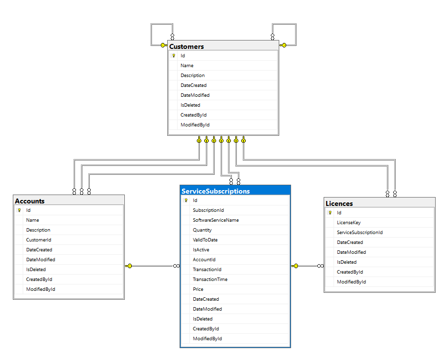

# crayon-coding-excercise

# Cloud Sales System

This repository contains the codebase for the Cloud Sales System, an application designed using Domain-Driven Design principles. 
The system is built on the .NET stack, with a focus on backend development using C#.

## Tech stack
- [.NET 8](https://dotnet.microsoft.com/en-us/download/dotnet/8.0) - Web Api
- [.SQL SERVER](https://www.microsoft.com/en-us/sql-server/sql-server-downloads) - Database

## How to run:
1. You need Visual Studio 2022 installed on your machine. 
2. Setup and start mutliple startup project, where you will run both CloudSalesSystem.API and CCpService (this is mock for cloud provider)
3. At startup DB will be created on local instance of SQL server

## Project Structure

- **CloudSalesSystem.Domain**: Contains the domain entities, aggregates, value objects, and domain services.
- **CloudSalesSystem.Application**: Implements the application layer, including use cases and application services. It also houses DTOs (Data Transfer Objects) for communication between layers.
- **CloudSalesSystem.Infrastructure**: Provides implementations for infrastructure concerns such as data access, external services integration, and cross-cutting concerns like logging and caching.
- **CloudSalesSystem.API**: Serves as the entry point for the system, exposing APIs to interact with the application.
- **CloudSalesSystem.IntegrationTests**: Contains integration tests to ensure the correctness of the system's behavior.
- **CCPService**: Additional service or module related to the Cloud Sales System.

## Package References

### CloudSalesSystem.Application

- FluentValidation 11.9.1
- Mapster 7.4.0
- MediatR 12.2.0

### CloudSalesSystem.Infrastructure

- Microsoft.AspNetCore.Http.Abstractions 2.2.0
- Microsoft.EntityFrameworkCore 8.0.4
- Microsoft.EntityFrameworkCore.SqlServer 8.0.4
- Microsoft.Extensions.DependencyInjection 8.0.0
- Microsoft.Extensions.DependencyInjection.Abstractions 8.0.0
- Microsoft.Extensions.Http 8.0.0
- Microsoft.Extensions.Http.Polly 8.0.4
- Newtonsoft.Json 13.0.3
- Polly 8.3.1
- Polly.Extensions.Http 3.0.0

### CloudSalesSystem.API

- Mapster 7.4.0
- MediatR 12.2.0
- Microsoft.AspNetCore.OpenApi 8.0.4
- Microsoft.EntityFrameworkCore.Tools 8.0.4
- Newtonsoft.Json 13.0.3
- Swashbuckle.AspNetCore 6.4.0

### CloudSalesSystem.IntegrationTests

- coverlet.collector 6.0.0
- Microsoft.AspNetCore.Mvc.Testing 8.0.4
- Microsoft.EntityFrameworkCore.InMemory 8.0.4
- Microsoft.NET.Test.Sdk 17.8.0
- Moq 4.20.70
- xunit 2.8.0
- xunit.runner.visualstudio 2.5.3

### CCPService

- Swashbuckle.AspNetCore 6.4.0

## Database Model

###Future improvements
- Implement Docker for containerization.
- Integrate pipeline behaviors for MediatR, including logging and validation pipelines.
- Incorporate Serilog for logging, configuring log levels for both development and production environments.
- Enhance exception handling mechanisms.
- Integrate memory caching where appropriate.
- Implement Redis caching functionality.
- Develop comprehensive unit tests.
- Write architecture tests to ensure system integrity and compliance with architectural principles.
- Extend functionality by implementing "Extend Quantity" and "Revoke" methods.
- Introduce domain events triggered on SaveChangesAsync operations.
- Provide a Postman collection for Quality Assurance (QA) testing.
- Incorporate concurrency timestamps where necessary.
- Integrate identity management functionality.

